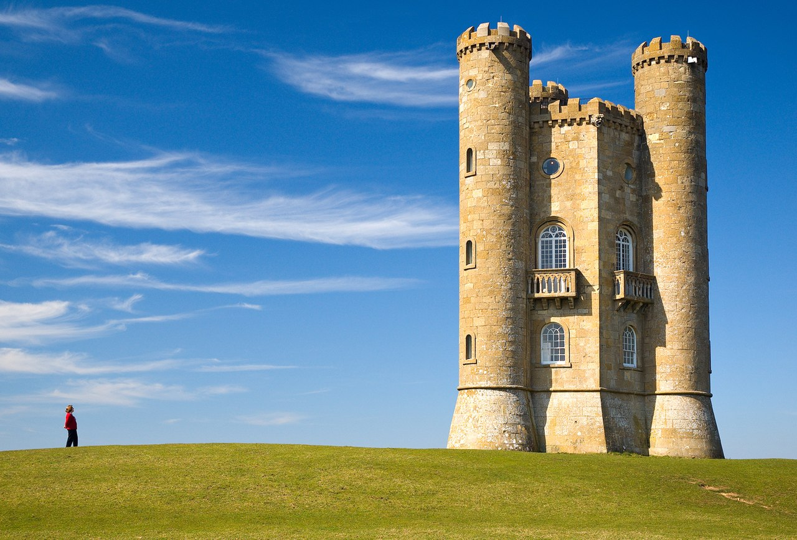
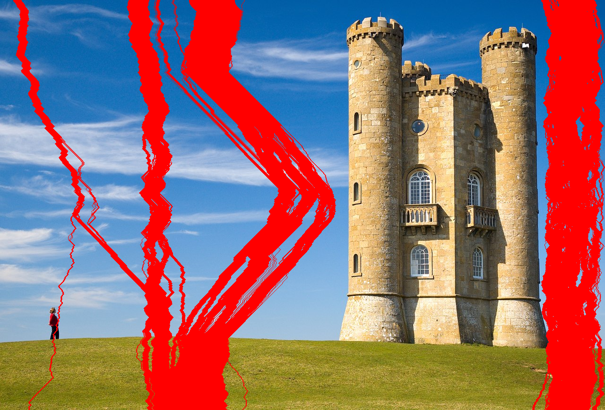
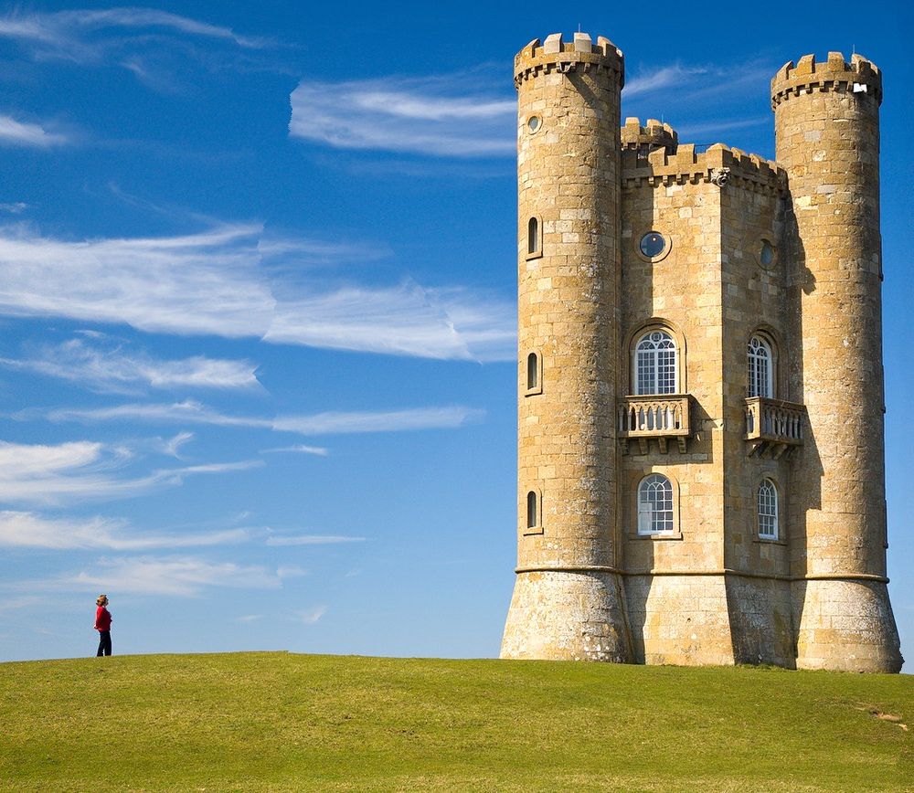
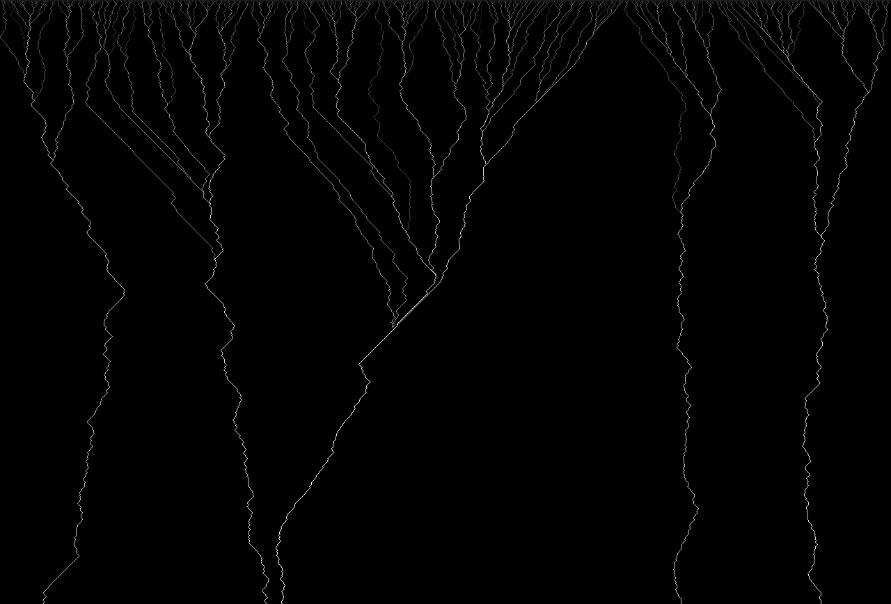

# Seam Carving

## Sujet

Le seam carving, ou recadrage intelligent, est un algorithme de
redimensionnement d'image consistant non pas en une mise à l'échelle classique
(par interpolation) ou un recadrage, mais par la suppression ou l'addition de
chemins de pixels dits de moindre énergie (en anglais, low-energy seams).

## Installation

Pour pouvoir compiler ce programme, il vous faudra CMake >= 3.24 et g++
supportant C++17. Il vous sera aussi nécessaire d'avoir installé OpenCV.

CMake devrait en outre installer de lui-même la bibliothèque
[`argparse`](https://github.com/p-ranav/argparse.git).

Pour créer l'exécutable `seam_carving`, exécutez

```sh
cmake .
make
```

Utilisation de cet exécutable :

```
seam_carving <image> [OPTIONS]
```

Options disponibles :

```
-o, --output        Image de sortie
-w, --width         Nouvelle largeur
-H, --height        Nouvelle hauteur
    --energy-paths  Export des chemins d'énergie, utile pour du débug
    --export-seams  Visualisation des coutures retirées, ne redimensionnera pas l'image
```

Un exemple d'utilisation pourrait être

```sh
./seam_carving ./examples/broadway_original.jpg -w 1000 -H 868 -o ./examples/boardway_resized.png
```

## Algorithme

L'algorithme peut se découper en 3 grandes étapes :

### 1 - Calcul de l'énergie

Chaque pixel de l'image se voit attribuer une valeur appelée énergie. De
nombreuses métriques peuvent être appliquées, mais la plus simple et assez peu
coûteuse est de calculer le gradient à partir des dérivées selon les axes X et
Y.

Notre image étant une image colorée, un choix doit là aussi être effectué sur
l'espace de couleur utilisé. Le système RGB s'avère assez convaincant, D'autres
espaces comme YCbCr, HSV, HSL ou LAB pourraient cependant être envisagés.

Le gradient est donc appliqué sur chaque canal indépendamment, avant de
fusionner les différents canaux. La norme euclidienne a ici été utilisée, mais
là encore une norme infinie aurait pu être choisie.

Enfin, une fois la matrice d'énergie calculée, sa matrice cumulée est calculée.

### 2 - Extraction des coutures

Pour extraire les différentes coutures, il nous suffit de trier les pixels
d'arrivée selon leur énergie, et de "remonter" pour retrouver les chemins
d'énergie minimale.

L'étape 1 étant assez couteuse, il nous faut limiter au maximum le re-calcul de
matrice d'énergie. Une optimisation est donc d'extraire plusieurs coutures par
matrice d'énergie, en respectant certaines contraintes, comme le fait que chaque
couture doit faire partie des 10% meilleures (contrainte qualitative) et doit
avoir une énergie inférieure au double de la meilleure couture (contrainte
quantitative).

Cette optimisation n'est cependant valable que si chaque nouvelle couture
n'en croise pas une précédente, sinon nous retrouverions des résultats faussés
comprenant des collisions et de mauvaises coupes, pouvant potentiellement couper
des zones à haute énergie.

### 3 - Redimensionnement

Une fois toutes nos coutures extraites, nous pouvons redimensionner l'image.

## Résultats

Réduction d'une image de 1280x868 pixels à 1000x868 pixels.

Image originale :



Coutures :



Image redimensionnée :



Énergie descendante, permettant de visualiser le ruissellement de l'énergie :



## Améliorations possibles

Une importante amélioration de performances pourrait être réalisée lors de la
sélection des coutures ; actuellement, pour savoir si une couture en intercepte
d'autres, nous devons tout de même la remonter, simplement pour récupérer son
origine. Or, de nombreux candidats échouent ce test, et le backtracking complet
étant assez couteux cette fonction ralentit radicalement le programme. Une
implémentation d'un mécanisme de fast-track est en cours sur la branche
`feat/optimize-seam-carve`, mais n'est toujours qu'en cours de développement.

## À propos

Projet réalisé dans le cadre du module PROJ001 : Projet d'analyse et de
traitement d'images à l'Université Savoie Mont-Blanc.

Auteurs :

- Romain THEODET - [@RomainTHD](https://github.com/RomainTHD)
- Yohann THEPAUT - [@ythepaut](https://github.com/ythepaut)
